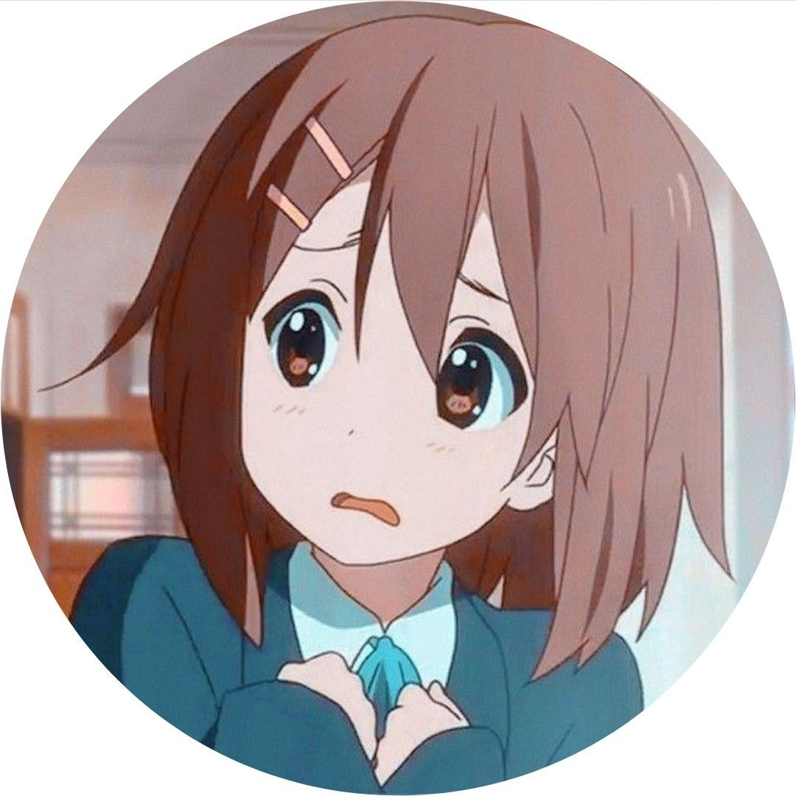

# Contribuyendo

    

## Notas a tener en cuenta(aplicación)
- No se aceptan pull requests que no estén relacionados con la funcionalidad principal del proyecto.
- Las contribuciones deben estar bien documentadas y comentadas (opcional).
- Las contribuciones deben estar bien probadas y funcionar correctamente.
- Las contribuciones deben subirse a la rama development/**.

## Sugerencias 
- Para formar parte de nuestro equipo, puedes escribirme a:[e-mail](mailto:yesangchun@gmail.com)
- En el correo electrónico, menciona el rol en el que te gustaría contribuir.
- Puedes postular a cualquier rol sin necesidad de conocimientos previos, "aquí aprendes".

## Roles de contribución
- desarrollo - (web con typescript y backend con rust)
- translators
- Redrawers
- typers
- Cleaners
- Raw hunters
